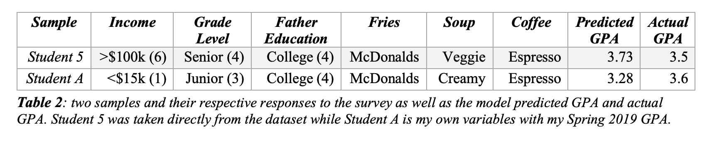

# Linear Regression Analysis

[Presentation PDF](https://abgaddi.github.io/course_projects/LRA/food_presentation.pdf)

# Written Analysis
It is well known that effective studying done by a student brings improvement to his/her GPA.  So, as college students approaching the end of the semester, this analysis was conducted to perhaps answer our curiosity of seeing if another factor outside of studying, such as our food choices, could improve GPA. This analysis looks at the question on whether a college student’s food associations and choices have a relationship to his/her GPA. The data used was collected from a survey from Mercyhurst University students.  Responses from the survey are compromised from individual’s food choices, ideas of nutrition, as well as a few demographics.  

In the first model created, all the food choice responses from the dataset were chosen as variables since they are the interest of this analysis along with most demographic variables.  All of the independent variables were qualitative with two or more levels.  Conducting a first order linear regression on all these variables resulted in a p-value less than an alpha of 0.05 and an adjusted R squared showing about 28% of the variance can be explained by this first model.  Although this model is statistically useful by the Global F Test, the adjusted R squared is not very high, so the next strategy attempted was to reduce these variables.  Performing a stepwise regression, both forward and backward, showed that the significant variables were coffee, soup, fries, income, grade level and father education.

In the final linear model, interaction terms were further tested to see if a larger improvement could be made on the adjusted R squared.  The three interaction terms added were between the three food variables.  Interaction terms between the demographic variables were not included and neither were interaction terms between food and demographic variables.  This is because intuitively, these interactions would be nonsensical. The final linear model was hypothesized to be:

After fitting the data to the interaction model, the model resulted with the best standard error of 0.57, meaning predictions of GPA using this model would fall within 1.14 of an individual’s true GPA. This was an improvement from the first standard error of 0.61.  An adjusted R squared of 0.36 meant that 36% of the variation is explained by this model.  The model also produced a low p-value, meaning the model is useful by the Global F test.  These numbers are shown in table 1 below along with the results of the previous models. Using a Nested F test between the first order model of reduced variables and the interaction term model, the interaction terms were found to be important for predicting GPA. 

Further residual analysis was then conducted from the final interaction model to check the normality assumption.  Overall, the residuals were heteroscedastic when plotted and had a relatively normal distribution (figure 1).  A Quantile-Quantile plot also shows normal residuals along the line for the theoretical samples, in support of the normality assumption. The residuals did not show any patterns suggesting a quadratic term or other increase in order. 

Of all the points that fell far from the majority of points, there were two outliers that were moderately influential by measuring their cook’s distance, which is shown in figure 2.  Looking closely at those entries, there were zeros found in some of the GPA responses.  Aside from these two points, there were also several other outliers that had zero entries.  This may have been from human error by misinterpreting the survey question or unclarity of the survey.  Removing all the samples with a zero, however, resulted in a much lower adjusted R squared.  Imputing the missing values was a possible strategy, but since GPA is the variable being predicted, imputing may cause bias in the sample. In the end, these data points were not removed from the dataset because not all the responses from the individual were zero, and those that were correctly recorded were useful for prediction. 

To complete the analysis using this model, two predictions were attempted using my own response to the survey and a randomly selected student, student five.  However, it is important to remember that the error is within 1.14 of the true GPA, which is about a whole letter grade, a great difference in reality.  A GPA higher than 4.0 is also not possible on a standard 4.0 scale. With this in mind, although the interaction model passed the Global F test, the adjusted R squared was still very low showing that the majority of the variance in GPA cannot be explained by this model.  The predicted inputs and results along with the true GPA are in table 2, below.

By looking at the outcomes of linear regression analysis on this data, it is possible that another model may be appropriate for predicting GPA.  The next analysis attempted used decision tree regression.  In simple terms, decision tree regression works by splitting the data into two groups until the leaves are ‘pure’ or there is no way to split the data anymore.  The resulting tree was created using a pre-established python module and can be seen in figure 3.  At each leaf, the number at the top represents where the model split the data going to the left if true and right if false.  The second number represents the mean squared error for that prediction. The third number represents how many samples from the data fell into this prediction, and the last number represents the predicted GPA. For this tree, the hyperparameter selected was a maximum node depth of five, chosen after trying several different node depths.  This model resulted in an R squared value of 0.65, which is a very large improvement from the linear models.  Despite this appealing R squared value, using a decision tree can lead still to overfitting the data. This is evident when looking at some of the leaf nodes of the tree where the sample size is only 1.

Using this model to predict yielded different results; the model predicted a 3.66 for student five and 3.56 for myself. The predicted GPAs of this model have a much smaller standard error compared to the second order model and are much closer to the true GPA for these samples.  Although it may seem convincing at first to use the decision tree over the second order model, another caveat of the decision tree is the hard-separating lines.  The predicted GPAs are not on a continuous scale like the linear models.  For example, following one path down the tree where none of the food choices caused a significant split means that two samples with similar demographics can have the same predicted GPA even though their food choices may be very different.

As the predictions for both these models have low accuracy, it is probable that this data is not the best for predicting GPA.  So, in conclusion, studying properly and attending class most likely has a larger impact on an individual’s GPA rather than his/her food choices.  For further studies to help improve accuracy, a more in-depth survey with more definitive responses should be conducted along with a larger sample size to be able to have more samples to build the decision tree off of or to see a clearer pattern between the independent and dependent variables.

